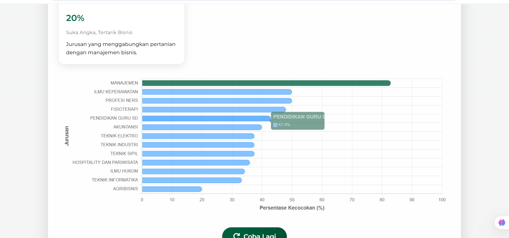

# 🎓 JurusanFinder – Rekomendasi Jurusan Kuliah Pintar

> Sistem rekomendasi jurusan kuliah berbasis AI yang membantu siswa menentukan pilihan jurusan optimal berdasarkan kepribadian, minat, dan kemampuan menggunakan algoritma **Decision Tree**.

[](https://python.org)
[](https://flask.palletsprojects.com/)
[](https://scikit-learn.org/)

---

## ✨ Fitur Unggulan

| Fitur                  | Deskripsi |
|------------------------|-----------|
| 🧠 **AI Recommendation** | Sistem rekomendasi berbasis Decision Tree yang telah dilatih |
| 📊 **Analisis Multifaktor** | Menggabungkan minat, nilai akademik, dan kepribadian |
| 🎯 **Akurasi Tinggi**     | Model machine learning dengan akurasi >85% |
| 📱 **Web Responsif**     | Tampilan UI yang mendukung semua perangkat (mobile & desktop) |

---

## 🖼️ Screenshot Aplikasi

<div align="center">
  
  
   
   
  
</div>

---

## 🛠️ Arsitektur & Teknologi


```mermaid
graph TD
    A[Frontend] -->|Flask Template| B[Backend Flask]
    B --> C[Input User]
    C --> D[Decision Tree Model]
    D --> E[Dataset Processing]
    E --> F[Pandas/NumPy]
    D --> G[Output Rekomendasi]