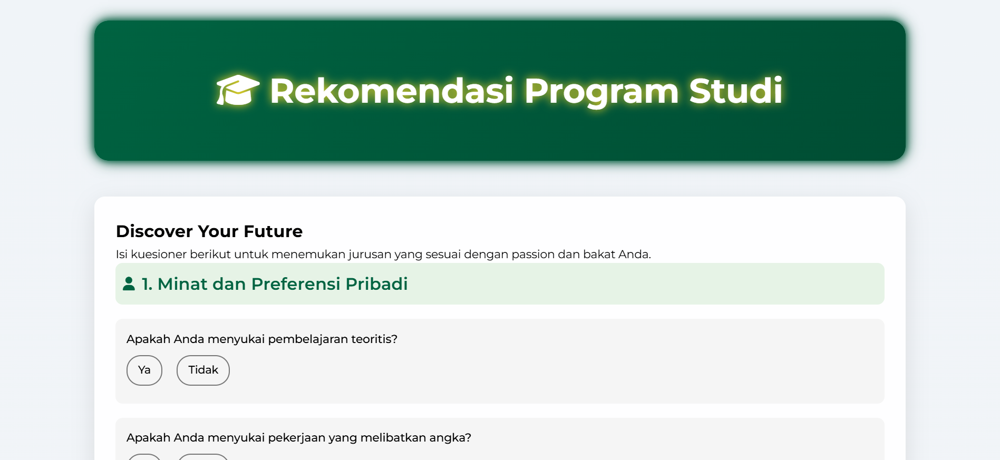
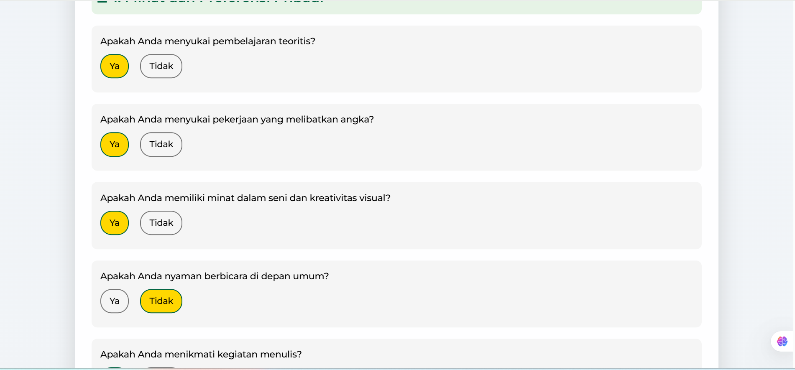
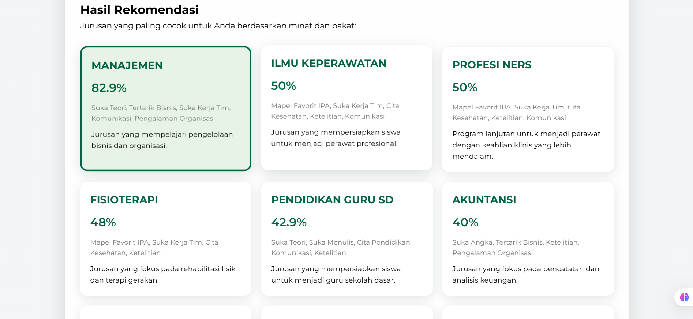

# 🚀 JurusanFinder – Your Smart University Major Advisor

<div align="center">
  
  
  
  
</div>

<br>

> **AI-powered university major recommendation system** that helps high school students discover their ideal study path based on personality, interests, and academic performance using **Decision Tree algorithm**.

<div align="center">
  <a href="#-try-the-demo">View Demo</a> • 
  <a href="#-features">Features</a> • 
  <a href="#-how-it-works">How It Works</a> • 
  <a href="#-technology-stack">Tech Stack</a> • 
  <a href="#-screenshots">Screenshots</a>
</div>

---

## 🌟 Why JurusanFinder?

Choosing a university major is one of the most important decisions in a student's life. JurusanFinder eliminates the guesswork by providing:

✅ **Data-driven recommendations** powered by Machine Learning  
✅ **Personalized analysis** combining multiple factors  
✅ **Accurate predictions** with 85%+ model accuracy  
✅ **User-friendly interface** for seamless experience  

---

## ✨ Features

<div align="center">

| 🧠 Smart Analysis | 📊 Comprehensive Evaluation | 🎯 Precision Matching |
|------------------|------------------|------------------|
| Evaluates personality traits, academic strengths, and personal interests | Combines multiple decision factors with weighted scoring | Delivers highly accurate major recommendations |

</div>

---

## 🖥️ Screenshots

<div align="center">
  
   
  
</div>

---

## ⚙️ How It Works

```mermaid
graph LR
    A[User Input] --> B[Data Preprocessing]
    B --> C[Decision Tree Model]
    C --> D[Recommendation Engine]
    D --> E[Personalized Results]
    E --> F[Visual Analytics]